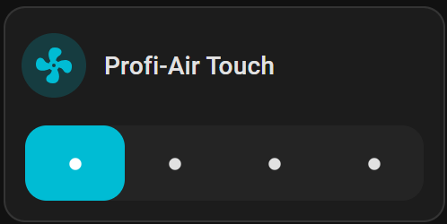

# fraenkische-profi-air-touch

[](https://github.com/desue90/profi-air-touch/releases)
[](https://github.com/desue90/profi-air-touch/blob/main/LICENSE)

Home Assistant Integration for Fränkische Profi-Air 250/400 Touch

## Features

This integration allows you to set the ventilation level of your controlled domestic ventilation via home assistant. This works via the following HTTP request:

`http://{self._host}/stufe.cgi?stufe={preset}`

`{self._host}` = IP address of the ventilation system

`{preset}` = level number 1 to 4

In addition, this integration provides certain sensors such as temperature values ​​that are read from the status.xml file of the ventilation system.

**Remark on level 4 - Party:**
The highest level is time-controlled, meaning that after a certain time, the ventilation system automatically resets to the previous level. This set time can be found in the web interface of the ventilation system on the "Setup" page.

## Requirements

The following requirements must be met:
* The ventilation system must be connected to the home network and accessible via a fixed IP address
* The "Control" must be set to "manual". You can do this, for example, via the web interface on the page "Week Schedule"

## Installation

Follow these steps to deploy the integration to Home Assistant.
You can choose to deploy it with [HACS](#hacs) or [manually](#manual)

### HACS

1. Make sure you have HACS installed or [install it now](https://hacs.xyz/docs/use/download/download/)
2. Open HACS in Home Assistant
3. Click on the 3 dots in the top right corner
4. Select "Custom repositories"
5. Add the URL `https://github.com/desue90/profi-air-touch` to "Repository" and select "Integration" as "Type"
6. Click the "ADD" button
7. Close the "Custom repositories" window
8. Search for "Profi-Air Touch" in HACS and open the integration by clicking on it
9. Press the download button and download the latest release

### Manual

1. [Download the latest release](https://github.com/desue90/profi-air-touch/releases)
2. Extract the `custom_components` folder to your Home Assistant's config folder. The resulting folder structure should be `config/custom_components/profi_air_touch`

## Setting up the Integration

1. Restart Home Assistant
2. After restart go to Settings > Devices & services
3. Click [ADD INTEGRATION](https://my.home-assistant.io/redirect/config_flow_start/?domain=profi_air_touch) and select "Profi-Air Touch"
4. Enter the IP address of the ventilation system
5. Select an area for the ventilation system and finisch the configuration

You now have an entity you can use to set 1 of the 4 available ventilation levels if you meet the [requirements](#requirements) listed above. Therefor add any card in the [dashboard](#dashboard) or create [automations](#automation), e.g. to control the timing of the different levels

## Dashboard

To control the ventilation levels via the dashboard, you can add any card. Personally, I find the following card very useful:



You can add it as follows:
1. Open the dashboard you want to add a new card for the ventilation system
2. Click the edit button
3. Add a card to a location of your choice 
4. Switch to the "By Entity" tab, search for the fan and select it
5. Add it to the dashboard
6. Edit the new card
7. Click "Show Code Editor"
8. Replace the code with the following:
```
features:
  - style: icons
    type: fan-preset-modes
    preset_modes:
      - Feuchteschutz
      - Abwesend
      - Wohnen
      - Party
type: tile
entity: fan.profi_air_touch_luftungsstufe
features_position: bottom
vertical: false
hide_state: true
show_entity_picture: false
```
9. Make sure you have the correct entity if yours has a different ID
10. Save it

## Automation

You can set the different ventilation levels automatically, e.g. via time control, using automations. To do so, proceed as follows:
1. Go to Settings > Automations & Scenes and select the "Create Automation" button
2. Select "Create new automation"

You now have the option to create a new automation [via the UI](#create-automation-via-ui) or to create it [using the YAML editor](#create-automation-via-yaml-editor) and the example code

### Create Automation via UI

You can choose any trigger and conditions you need. Let's say you want to set the lowest level of your ventilation system at 10 a.m. from Monday to Friday:
1. Add Trigger > Time and Place > Time
2. Set Time at 10:00:00 (Format = hh:mm:ss)
3. Add Condition > Time and Place > Time
4. Leave the time fields empty and add only the desired weekdays on which the automation should run
5. Add Action > Fan > Set Preset Mode
6. Choose your new entity, e.g. "fan.profi_air_touch_luftungsstufe"
7. Choose one of the following 4 preset modes. You must specify the preset mode as text:
    - Level 1:  `Feuchteschutz`
    - Level 2:  `Abwesend`
    - Level 3:  `Wohnen`
    - Level 4:  `Party`       [See Remark](#features)
8. Save your new automation and give it a name

### Create Automation via YAML editor

1. Click on the 3 dots in the top right corner and select "Edit in YAML"
2. Replace all lines with the following example code:
```
alias: Set ventilation to humidity suppression
description: ""
triggers:
  - trigger: time
    at: "10:00:00"
conditions:
  - condition: time
    weekday:
      - mon
      - tue
      - wed
      - thu
      - fri
      - sat
      - sun
actions:
  - action: fan.set_preset_mode
    metadata: {}
    data:
      preset_mode: Feuchteschutz
    target:
      entity_id: fan.profi_air_touch_luftungsstufe
mode: single
```
3. To customize the automation you can change the following lines:
 - `alias:`         Give a meaningful name for your automation
 - `at:`            Set a time in the format hh:mm:ss
 - `weekday:`       Remove all days on which the automation should not run
 - `preset_mode:`   Set one of the 4 preset modes. You must specify the preset mode as text:
    - For level 1 take:  `Feuchteschutz`
    - For level 2 take:  `Abwesend`
    - For level 3 take:  `Wohnen`
    - For level 4 take:  `Party`       [See Remark](#features)
 - `entity_id:`     Select your fan entity
4. Save your new automation 

## Tested Setup

* Fränkische Profi-Air 400 Touch

## Contribute

If you want to help, put a ⭐ to the repository and open issues or pull requests to contribute to the development.
